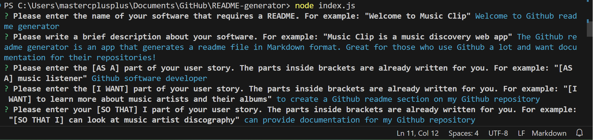

## Table of Contents

[Table of Contents](#table-of-contents)

[Software License](#software-license)

[Description of this software](#description-of-this-software)

[User Story](#user-story) 

[Acceptance Criteria](#acceptance-criteria)

[Key Technologies Used](#key-technologies-used)

[How to install and use](#how-to-install-and-use) 

[Contact for Comments, Concerns, Questions, etc.](#contact) 
 
 
[Software License](software-license)
 
Welcome to the README-generator!
When you have properly set up Visual Studio Code, your Terminal should look like this and you can begin to use this app:

Software license for this software:

# Welcome to the README Generator!

MIT License

mit-license.org

  
[Description of this software](description)

The README Generator is an application that creates a README file specifically designed for your Github repository. You can use this for your other software projects. A good software package demands a good README documentation!

[User Story](user-story) 

AS A Github software developer 

I WANT to have a good README file for my repository 

SO THAT I my users have a reference documentation in case they need help with the software that they downloaded on the web

[Acceptance Criteria](acceptance-criteria)

GIVEN a command-line application that accepts user input, WHEN I am prompted for information about my application repository, THEN a high-quality, professional README.md is generated with the title of my project and section entitled Description/Table of Contents/Installation/Usage/License/Contributing/Tests/Questions

You can view the software's web page at this link. [Welcome to the README Generator!](https://github.com/calcomsci/README-generator)

[Three Key Technologies Used, if any](key-technologies-used)

Markdown 

What Markdown  is used for:

Markdown is used to create the README file's contents in .MD format

NodeJS

What NodeJS is used for:

NodeJS is used to create the prompts on the command line

Github

What Github is used for:

Github is used to upload the repository for this software package

[How to use and install this open source software](how-to-install)

From Github, you can download the source code by clicking on the Code button and download the zip file here: https://www.github.com/calcomsci

You will need a code editor to view the source code. You may try Visual Studio Code. You may download Visual Studio Code here: https://code.visualstudio.com/Download

You will probably need node.js to install packages from the source code. You may download node.js here: https://nodejs.org/en/download/

[Contact for Comments, Concerns, Questions, etc.](contact)

If you wish to contribute to this open source software, please contact me, and/or fork this on Github

[Contact for Comments, Concerns, Questions, etc.](contact)

You can visit my Github profile (where you should have found out about this software) at: https://www.github.com/calcomsci

You can write an e-mail to calcomsci@outlook.com 
